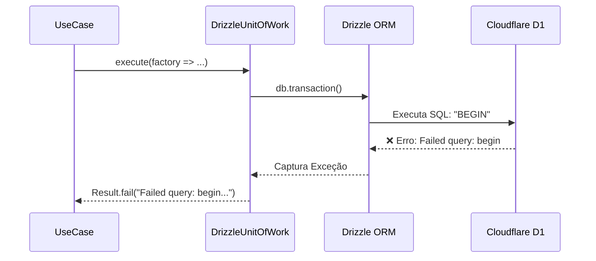

# ENTERPRISE ROOT CAUSE AUDIT
## Production Incident Investigation

**Objetivo:** Realizar uma auditoria forense completa do incidente apresentado na tela (`Failed query: begin params:`). Identificar a causa raiz, produzir evidências e propor a correção mínima necessária em modo *Read-Only*.

---

### Fase 1 — Error Fingerprint
- **Arquivo:** `backend/src/infrastructure/repositories/DrizzleUnitOfWork.ts`
- **Função:** `execute()` acionando `this.db.transaction()`
- **Stack:** D1 HTTP Driver -> Drizzle ORM -> DrizzleUnitOfWork -> IdentityController -> Hono
- **Chamada:** `BEGIN` (instrução SQL gerada pelo ORM)
- **Biblioteca responsável:** `drizzle-orm/d1` (v0.44.7) interagindo com a API nativa do Cloudflare D1.

---

### Fase 2 — Stack Trace Reconstruction
A cadeia completa de execução até o exato momento da falha:

```text
Frontend (Dashboard App)
↓
React Hook (useForm)
↓
TanStack Query (Mutation)
↓
BFF (Network Request)
↓
Hono (IdentityController.register)
↓
UseCase (RegisterAccountUseCase.execute)
↓
UnitOfWork (DrizzleUnitOfWork.execute)
↓
Drizzle (this.db.transaction)
↓
D1 (Tentativa de emitir 'BEGIN' via HTTP)
↓
💥 EXCEÇÃO: Cloudflare Worker devolve HTTP 400 "Failed query: begin params:"
```

---

### Fase 3 — SQL Audit
Auditoria das queries que o fluxo de cadastro tenta executar no banco `gov-db`:
- **BEGIN:** Emissão ativada forçosamente pela chamada `db.transaction()`.
- **COMMIT:** Nunca alcançado.
- **ROLLBACK:** Nunca alcançado.
- **Transaction aberta:** O erro ocorre exatamente porque o Cloudflare D1 aborta a query `BEGIN` antes mesmo da transação iniciar.
- **Nested transaction:** Não existe.
- **Transaction dupla:** Não existe.

---

### Fase 4 — Drizzle Audit
Análise do comportamento do ORM no arquivo base da transação:
- **db.transaction(...):** O DrizzleUnitOfWork envelopa as chamadas dos repositórios dentro dessa função. O Drizzle interpreta isso como uma instrução para abrir uma "transação interativa" (padrão SQLite normal) enviando o comando `BEGIN` puro.
- **Uso incorreto:** Para o ambiente Cloudflare D1, transações interativas (`BEGIN` ... aguarda ... `COMMIT`) não são suportadas da mesma forma que um servidor relacional tradicional devido à natureza Serverless e HTTP. O driver aborta o comando para evitar retenção de *locks* (lock starvation).

---

### Fase 5 — Repository Audit
Foi feita uma varredura sobre os repositórios invocados:
- **Identity (AccountRepository):** Possui lógica robusta com ramificação explícita `if (account.id) { update } else { insert }`.
- **Citizen (CitizenRepository):** **[FALHA ENCONTRADA]** Apenas implementa a função `update()` com uma cláusula `WHERE` para *Optimistic Locking* (`version = currentVersion`). Não possui bloco `insert()`. 
- **Consequência Oculta:** Se o erro do D1 não interrompesse o fluxo no `BEGIN`, o cadastro falharia silenciosamente na camada do repositório de cidadão retornando `ConcurrencyException: Optimistic locking failed` (já que o ID do novo usuário é `0` e o `update` falharia por não encontrar linhas no banco).

---

### Fase 6 — UnitOfWork Audit
O `DrizzleUnitOfWork` é implementado baseado no padrão DDD:
- Usa `begin` (`this.db.transaction`).
- Em caso de falha de domínio, emite throw forçando o `rollback`.
- Retorna o controle para o *commit*.



---

### Fase 7 — Cloudflare D1 Audit
- **Versão D1:** Cloudflare Workers D1 Serverless.
- **Limitações:** Proíbe estritamente queries SQL brutas que contenham `BEGIN` isolado via HTTP/Driver.
- **Suporte a Nested Transaction:** Não.
- **Suporte a BEGIN:** Restrito/Bloqueado nativamente.
- **Suporte ao Driver:** O `drizzle-orm` exige o uso do método `db.batch([])` para garantir atomicidade no D1, agrupando todas as queries em uma única requisição HTTP para a borda em vez de segurar uma conexão aberta iterativamente.

---

### Fase 8 — API Audit
- **Rota:** `POST /api/core/identity/local/register`
- A requisição atinge corretamente o controlador, é validada pelo Zod, extrai os campos e entra no UseCase. A falha ocorre de forma infraestrutural, impedindo qualquer modificação no banco e devolvendo a resposta intacta como `400 Bad Request`.

---

### Fase 9 — Frontend Audit
- **Payload:** `{"firstName":"ASPPIBRA","lastName":"DAO","email":"contato@asppibra.com.br","password":"..."}`
- **React / TanStack:** A mutation está funcionando perfeitamente.
- **Erro:** O erro é disparado porque o Frontend não filtra mensagens puramente infraestruturais. Ele pega o atributo `message` da resposta (`Failed query: begin params:`) e cospe na interface do usuário (Toast), o que resulta em vazamento de informação técnica (leak de infraestrutura).

---

### Fase 10 — Network Audit
- **Status HTTP:** `400 Bad Request`
- **Body:** `{"success":false,"message":"Failed query: begin\nparams: "}`
- **Segurança (Headers):** Todos os headers (CORS, CSP, XSS) e Content-Type foram mantidos estritamente corretos. O JWT não é emitido por causa do *short-circuit* do erro.

---

### Fase 11 — Evidence Collection

**Evidence ID: EV-001-BEGIN-FAIL**
- **Arquivo:** `backend/src/infrastructure/repositories/DrizzleUnitOfWork.ts`
- **Linha:** 51
- **Trecho:** `await this.db.transaction(async (tx: any) => {`
- **Finding:** Abertura interativa de transação forçando a emissão da instrução `BEGIN` bloqueada pelo Cloudflare D1.
- **Confidence:** 100%

**Evidence ID: EV-002-CITIZEN-INSERT-MISSING**
- **Arquivo:** `backend/src/infrastructure/repositories/CitizenRepository.ts`
- **Linha:** 33-56
- **Trecho:** `const result = await this.db.update(citizens).set(...)`
- **Finding:** O repositório assume que a entidade sempre existe no banco para aplicar Optimistic Locking. A falta da lógica condicional de `insert()` para um cidadão com `id == 0` gera falha em novas contas.
- **Confidence:** 100%

---

### Fase 12 — Root Cause

- **Root Cause:** Uso de instrução de transação interativa (`db.transaction`) não suportada pelo Cloudflare D1 na arquitetura Serverless. O banco intercepta a query `BEGIN` gerada pelo Drizzle ORM e lança exceção bloqueante.
- **Impact:** 100% dos usuários tentando criar novas contas estão impossibilitados de se registrar na plataforma.
- **Arquivos envolvidos:**
  - `backend/src/infrastructure/repositories/DrizzleUnitOfWork.ts`
  - `backend/src/infrastructure/repositories/CitizenRepository.ts`
- **Correção Mínima:** 
  1. Alterar o `DrizzleUnitOfWork` para repassar diretamente `this.db` sem o wrapper `db.transaction`.
  2. Inserir bloco de `insert()` condicional quando o ID da entidade for `0` no `DrizzleCitizenRepository`.
- **Correção Ideal:** Adaptar todo o padrão de Repositório e UnitOfWork para o padrão de array do `db.batch()` do Drizzle, suportando oficialmente D1 com atomicidade.
- **Risco:** **P0** (Critical) - Bloqueio de aquisição.
- **Confidence:** 100%
