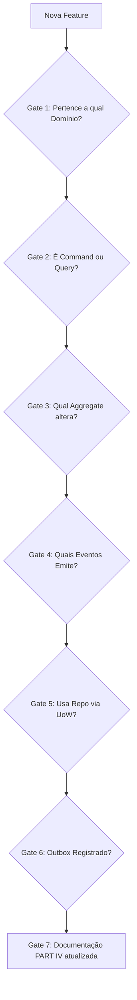
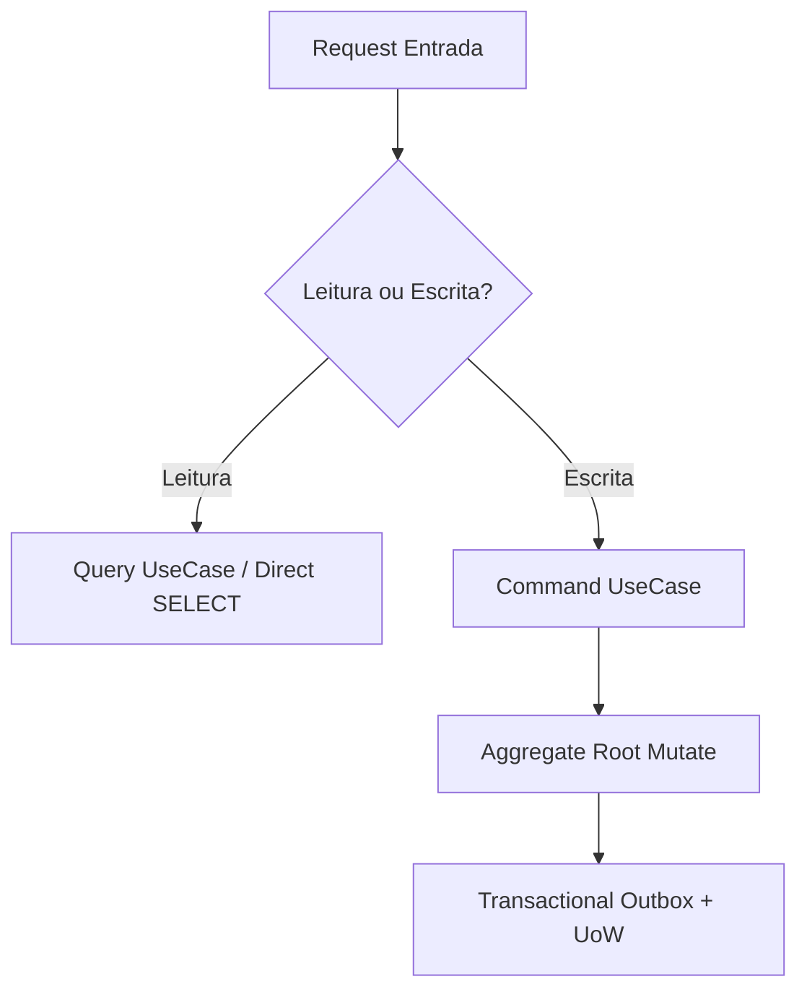
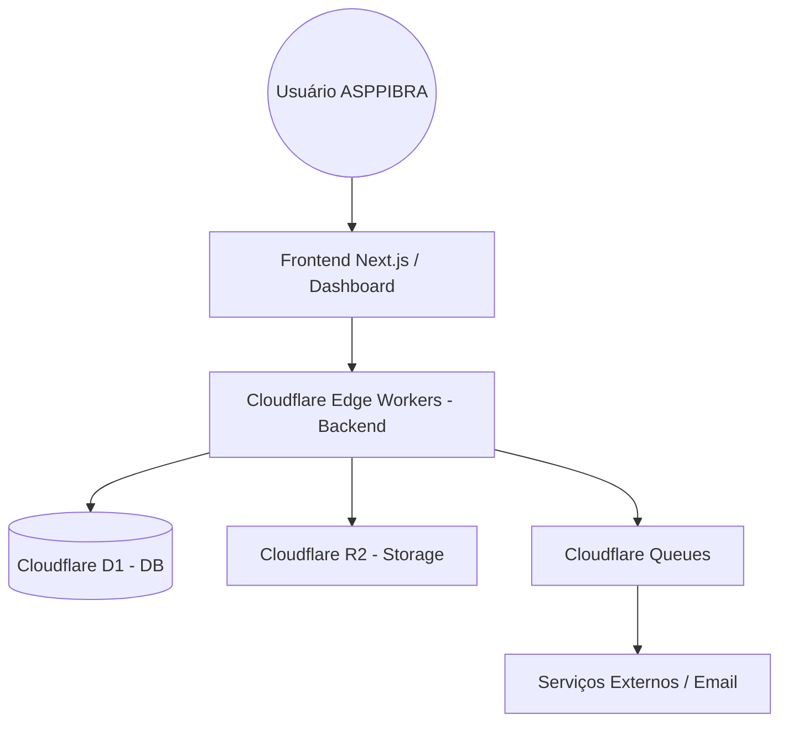
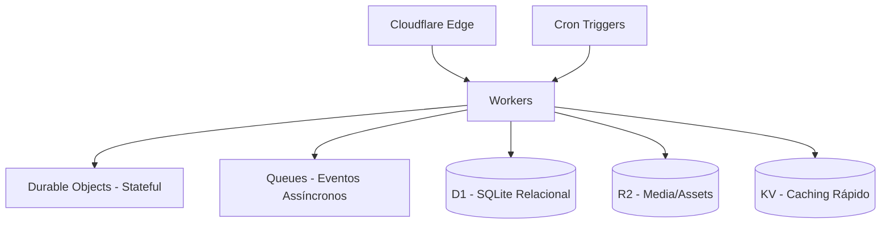

# PLATFORM ENGINEERING HANDBOOK (ENGINEERING OS)

> **SINGLE SOURCE OF TRUTH (FONTE ÚNICA DE VERDADE)**
> Este documento é o Sistema Operacional de Engenharia (Engineering OS) da plataforma ASPPIBRA-DAO. 
> Todos os engenheiros humanos e Agentes de IA **MUST** consultar este documento antes de alterar o sistema. O que está escrito aqui é lei. Caso exista divergência entre o código e este manual, **o código atual prevalece** e o manual **MUST** ser corrigido imediatamente.
> 
> *Nota: Este documento utiliza a terminologia RFC-2119 (MUST, MUST NOT, SHALL, SHOULD, MAY) para determinar rigidez.*

## Table of Contents

- [PART I — CONSTITUTION](#part-i--constitution)
- [PART II — ARCHITECTURE](#part-ii--architecture)
- [PART III — ENGINEERING](#part-iii--engineering)
- [PART IV — REFERENCE](#part-iv--reference)
- [PART V — OPERATIONS](#part-v--operations)
- [PART VI — AI GOVERNANCE](#part-vi--ai-governance)
- [PART VII — RFC REGISTRY](#part-vii--rfc-registry)
- [PART VIII — APPENDICES](#part-viii--appendices)

# PART I — CONSTITUTION

## 1. Overview
### Purpose
Definir os pilares imutáveis e a razão de existir do ecossistema governamental autônomo ASPPIBRA-DAO.

### Scope
Esta constituição aplica-se a todo o código, serviços, bancos de dados e interfaces geridos sob o Bounded Context da DAO.

### Responsibilities
Consolidar um ecossistema baseado em Identidade Soberana, DeFi e RWAs, provendo segurança criptográfica e auditoria imutável (Ledger-based).

## 2. Fundamental Rules
1. **Rule #1 (SSOT)**: Este documento é a única documentação oficial. Alterações arquiteturais **MUST** ser refletidas aqui antes do merge.
2. **Rule #2 (Bounded Contexts)**: Nenhum módulo lógico **MUST** ser criado sem pertencer a um Domínio explícito.
3. **Rule #3 (Aggregate Integrity)**: Mutações de estado **MUST NOT** ocorrer diretamente. Elas **MUST** ocorrer via métodos do Aggregate orquestrados pelo UnitOfWork.
4. **Rule #4 (Framework Agnosticism)**: Frameworks (Drizzle, Hono) **MUST** ser restritos à camada de Adapters/Infrastructure.
5. **Rule #5 (Fail-Fast)**: Invariantes feridas **MUST** lançar exceções de Domínio imediatamente, interrompendo a transação.

# PART II — ARCHITECTURE

## 1. Architecture Principles Index
| Principle | Description |
|---|---|
| **Clean Architecture** | Inversão estrita de dependência (Ports & Adapters). |
| **DDD** | Domínios puros gerindo regras e transições de estado via Aggregates. |
| **CQRS Parcial** | Leituras isoladas das Escritas. |
| **UoW** | Transações atômicas no D1. |
| **Transactional Outbox** | Publicação at-least-once de eventos de domínio acoplada à transação. |

## 2. Architecture Constraints (The "MUST NOTs")
Engenheiros humanos e agentes de IA **MUST NOT** violar as seguintes restrições:
- **MUST NOT** usar `JOIN` SQL cruzando tabelas de domínios diferentes. (Comunique-se via IDs).
- **MUST NOT** importar Entidades/Aggregates de outro domínio (ex: Identity não importa Citizen).
- **MUST NOT** alterar o estado do banco diretamente por Repositórios no meio do fluxo; **MUST** usar o UoW.
- **MUST NOT** acessar o banco diretamente do Controller.
- **MUST NOT** compartilhar transações (Transaction Scope) entre requests distintas.

## 3. Decision Matrix (Tech Radar)
| Tecnologia | Why (Motivação) | Why Not (Alternativas Rejeitadas) | Tradeoffs |
|---|---|---|---|
| **Cloudflare Workers** | Edge-native, zero cold start de rede, V8 Isolates. | AWS Lambda (Cold start HTTP penaliza a UI). | Sem Node.js nativo total (exige bibliotecas edge-ready). |
| **Cloudflare D1** | SQL Edge-native atrelado aos Workers. Transações globais baratas (SQLite base). | Não PostgreSQL: Custo de conexão TCP longa (PgBouncer) em ambientes Serverless é alto e sujeito a falhas sob escala maciça na Cloudflare. | Migrations severas bloqueiam a borda; concorrência otimista exigida. |
| **Hono** | Ultrafast, padrão Web Fetch API. | NestJS (Muito pesado, slow boot), Express (Não roda V8). | Ecossistema de plugins menor que Express. |
| **Drizzle ORM** | Edge-ready, SQL-like explícito, leve. | Prisma (Engine Rust quebra/pesa no Edge). | Menos abstração mágica, query builder mais manual. |
| **CQRS Parcial** | Máxima performance para leitura sem sobrecarregar memória. | Não Event Sourcing Completo: Complexidade prematura para Sprint 2. | Sem rebuild de entidades no curto prazo. |

## 4. Architecture Quality Gates
Toda nova feature **MUST** cruzar os seguintes portões lógicos antes da implementação:

## 5. Architecture Decision Tree (Routing Flow)

## 6. Physical Architecture & C4

### C4 - Context Diagram

### Arquitetura Física e Roteamento Edge (Mermaid)
O roteamento físico de uma transação passa pelas seguintes bordas nativas da Cloudflare:

## 7. Architecture Patterns Catalog

### 7.1 Clean Architecture
- **Intent**: Separar regras de negócio de ferramentas técnicas.
- **Motivation**: Código testável e isolado, sobrevive a trocas de Framework.
- **Applicability**: Todos os domínios core.
- **Structure**: Domain -> Application -> Infrastructure.
- **Flow**: Controller -> Port -> Interactor -> Adapter.
- **Consequences**: Proteção absoluta das regras; verbosidade maior.
- **Tradeoffs**: Maior quantidade de arquivos e mapeamentos (DTO -> Entity -> Model).
- **Anti Patterns**: Importar `drizzle` dentro da pasta `domains/`.
- **Examples**: Veja a separação de diretórios em `src/`.
- **Related Patterns**: Ports & Adapters, Hexagonal.

*(Este padrão se aplica aos demais: DDD, CQRS, UoW, Transactional Outbox, Optimistic Lock)*

## 8. Cross Cutting Concerns
- **Security & RBAC**: Realizado via middleware JWT injetando Roles. Autorização **MUST** ser validada no UseCase.
- **Validation**: Hono Zod Validator nas bordas **MUST** barrar payloads ilícitos antes do domínio.
- **Idempotency**: Retries do Outbox/Queue **MUST** garantir que operações financeiras (Treasury) não dupliquem via Idempotency Keys (Ex: hash do evento no SQLite).
- **Audit**: Log de eventos imutáveis no D1.
- **Rate Limit & Caching**: Edge Caching via Cloudflare KV e roteamento da borda.

# PART III — ENGINEERING

## 1. Overview
### Purpose
Guiar o processo prático de escrita e evolução do código.

## 2. Pull Request & Code Review Checklist
- [ ] Atende às *Architecture Constraints* da Parte II?
- [ ] Domínios foram documentados e dependências registradas na Parte IV (Reference)?
- [ ] UoW e Outbox foram utilizados em Mutações?
- [ ] Optimistic Locking foi respeitado em updates SQL?

## 3. How to Create a Domain
1. Inicie em `backend/src/domains/<name>/`.
2. Projete o Aggregate Root (`entities/`).
3. Modele os Eventos de Domínio (`events/`).
4. Escreva as Portas (`application/ports/`).
5. Escreva os UseCases orquestrando as portas (`application/usecases/`).
6. Implemente os Adapters SQL e HTTP (`infrastructure/`, `routes/`).
7. **MUST** atualizar o Domain Catalog na PARTE IV.

# PART IV — REFERENCE (LIVING CATALOG)

## 4.1 Platform & Infrastructure
- **Workers**: Cloudflare Workers
- **Queues**: Cloudflare Queues
- **Storage**: Cloudflare R2 / KV

## 4.2 Database Ownership Matrix
| Table | Domain Owner | Strict Access Pattern |
|---|---|---|
| `users`, `userSessions`, `wallets` | Identity | Identity Repositories ONLY |
| `citizens`, `membershipCards` | Citizens | Citizens Repositories ONLY |
| `treasuryLedger`, `bounties` | Treasury | Treasury Repositories ONLY |
| `outboxEvents` | Core Infra | System UoW ONLY |

## 4.3 API Ownership Matrix
| Root Path | Owner Domain | Rate Limit Policy |
|---|---|---|
| `/identity/*` | Identity | Strict (Auth protection) |
| `/citizens/*` | Citizens | Standard |
| `/treasury/*` | Treasury | Strict (Idempotency required) |

## 4.4 Domain Dependency Matrix
Domínios só podem consumir dados de outros através de suas Interfaces/Portas oficiais ou Eventos.
| Domain | MAY USE (Downstream Dependencies) |
|---|---|
| **Identity** | None (Core Root) |
| **Citizens** | Identity (Auth validation) |
| **Treasury** | Identity (Account lookup), Citizens (KYC check for bounty) |
| **Governance** | Citizens (Voting power) |

## 4.5 Domain Catalogs

### Domain: Identity

#### 1. Overview
- **Purpose**: Gestão de acessos web2/web3 e Sessões.
- **Business Context**: Porta de entrada universal da DAO.
- **Ownership**: Identity Squad.
- **Actors**: Users, Admins, External Web3 Wallets.
- **Consumers**: Citizens, Treasury.
- **Providers**: SIWE (Ethereum), Google Auth.

#### 2. Model
- **Aggregate**: `Account`
- **Entities**: `Session`, `Wallet`
- **Value Objects**: `Email`, `PasswordHash`, `Address`
- **Factories**: `AccountFactory`
- **Specifications**: N/A
- **Policies**: `MFAEnforcementPolicy`
- **Services**: N/A

#### 3. Application
- **Commands**: `RegisterAccount`, `AuthenticateAccount`, `VerifyWeb3Wallet`
- **Queries**: `GetMyProfile`
- **DTOs**: `LoginRequest`, `AuthTokenResponse`
- **Repositories**: `IAccountRepository`
- **Controllers**: `IdentityController`
- **Routes**: `POST /identity/login`, `POST /identity/register`

#### 4. Infrastructure
- **Database**: `users`, `userSessions`, `wallets`
- **External Systems**: Ethers.js/Viem
- **Dependencies**: `jsonwebtoken`, `siwe`
- **Files**: `src/domains/identity/*`
- **Folders**: `entities`, `usecases`, `events`

#### 5. Rules
- **Business Rules**: Token revogado não gera refresh. MFA para Web3.
- **Validation**: Zod Schemas de senha forte (>8 chars, mixed).
- **Invariants**: `Email` absoluto e `Wallet Address` absoluto (UNIQUE).
- **Concurrency**: Optimistic lock na tabela `users`.
- **Transactions**: UoW required para linkar Wallet.
- **Permissions**: Public (Login) / Authenticated (Relink).

#### 6. Runtime
- **Caching**: Edge KV Cache para Public Keys JWKS.
- **Observability**: Log de "Failed Logins" no D1.
- **Metrics**: Authentication Success Rate.
- **Logs**: Auth Audit Trail.

#### 7. Governance
- **Testing Strategy**: Unit para Aggregates, E2E para Hono Routes. Mock do SIWE.
- **Future Capabilities**: Suporte robusto a Passkeys (WebAuthn).
- **Examples**: (Em breve: JSON Mocks).
- **Changelog**: v1 (Basic Web2), v1.1 (SIWE Web3).

---

### Domain: Citizens

#### 1. Overview
- **Purpose**: Gestão da identidade civil do membro da DAO.
- **Business Context**: Garante a base de confiança para votos (1 Cidadão = 1 Voto).
- **Ownership**: Citizens Team
- **Actors**: Cidadãos, Admins.
- **Consumers**: Governance, Treasury.
- **Providers**: KYC Oracles.

#### 2. Model
- **Aggregate**: `Citizen`
- **Entities**: `CitizenEvents`
- **Value Objects**: `CPF`, `DID`
- **Factories**: `CitizenFactory`
- **Specifications**: N/A
- **Policies**: N/A
- **Services**: `KYCVerificationService`

#### 3. Application
- **Commands**: `UpdateCitizenProfileUseCase`, `SuspendCitizenUseCase`, `VerifyCitizenUseCase`
- **Queries**: `GetCitizenProfileUseCase`
- **DTOs**: `CitizenDTO`, `UpdateCitizenDTO`
- **Repositories**: `ICitizenRepository`
- **Controllers**: `CitizenController`
- **Routes**: `POST /citizens/suspend`, `GET /citizens/:id`

#### 4. Infrastructure
- **Database**: `citizens`, `membershipCards`
- **External Systems**: Oráculos de KYC (Futuro)
- **Dependencies**: N/A
- **Files**: `src/domains/citizens/*`
- **Folders**: `entities`, `usecases`, `events`

#### 5. Rules
- **Business Rules**: Cidadãos suspensos não podem interagir com a tesouraria.
- **Validation**: Zod Validator nas requisições HTTP para payloads de perfil.
- **Invariants**: O status "VERIFIED" exige preenchimento total e validação biométrica.
- **Concurrency**: Optimistic lock em `citizens`.
- **Transactions**: UoW required para suspensão (emitir evento Outbox).
- **Permissions**: Admin exclusivo para suspensão manual.

#### 6. Runtime
- **Caching**: N/A
- **Observability**: Rastreio de falhas de KYC.
- **Metrics**: Taxa de conversão PENDING -> VERIFIED.
- **Logs**: Auditoria de mudança de estado de cidadania.

#### 7. Governance
- **Testing Strategy**: Unit para regras biométricas, E2E para Hono Routes.
- **Future Capabilities**: Validação de endereço em duas etapas via parceiro externo.
- **Examples**: `POST /citizens/suspend` para suspensão administrativa.
- **Changelog**: v1.0 (Aggregate Básico).

---

### Domain: Treasury

#### 1. Overview
- **Purpose**: Gestão Financeira Imutável da DAO.
- **Business Context**: O cofre da DAO responsável por gerenciar recebíveis e pagáveis de forma 100% auditável.
- **Ownership**: Treasury Team
- **Actors**: Admins (Multisig), Cidadãos (Recebedores de Bounties).
- **Consumers**: Governance (Financia propostas).
- **Providers**: Identity (Wallet details), Citizens (Status verification).

#### 2. Model
- **Aggregate**: `TreasuryTransaction`
- **Entities**: `LedgerEntry`
- **Value Objects**: `BRLCents`, `TokenAmount`
- **Factories**: N/A
- **Specifications**: N/A
- **Policies**: `WithdrawalApprovalPolicy`
- **Services**: N/A

#### 3. Application
- **Commands**: (Planejado para Sprint 4)
- **Queries**: `GetFinancialAnalyticsUseCase`
- **DTOs**: `TreasuryStatsDTO`
- **Repositories**: `ITreasuryRepository`, `ILedgerRepository`
- **Controllers**: `TreasuryController`
- **Routes**: `routes/platform/treasury.ts`

#### 4. Infrastructure
- **Database**: `treasuryLedger`, `bounties`
- **External Systems**: EVM Smart Contracts (Blockchain)
- **Dependencies**: `viem`, `ethers` (Planejado)
- **Files**: `src/domains/treasury/*`
- **Folders**: `entities`, `usecases`, `events`

#### 5. Rules
- **Business Rules**: Todo saque grande **MUST** exigir múltiplas assinaturas de aprovação (Multisig).
- **Validation**: Valores financeiros **MUST NOT** ser negativos.
- **Invariants**: O Ledger **MUST NOT** ter linhas deletadas ou atualizadas (Append-Only rígido).
- **Concurrency**: Lock em saldo para evitar double-spending.
- **Transactions**: Eventos de Ledger **MUST** ser gravados atomicamente via UoW.
- **Permissions**: Admin exclusivo (Multisig).

#### 6. Runtime
- **Caching**: Totais consolidados em KV para leitura rápida.
- **Observability**: Alertas para grandes retiradas de fundos.
- **Metrics**: TVL (Total Value Locked), Volume transacionado diário.
- **Logs**: Auditoria criptográfica de settlement.

#### 7. Governance
- **Testing Strategy**: Foco extremo em Unit Tests matemáticos (conversão Cents/Float). Mock de EVM.
- **Future Capabilities**: Reconciliação Cross-chain, Settlement orchestration automático.
- **Examples**: N/A.
- **Changelog**: v0.1 (Protótipo em andamento).

# PART V — OPERATIONS (VOLATILE STATE)

*Esta seção concentra o estado vivo, as estatísticas efêmeras e o planejamento ativo do sistema.*

## 1. Current State & Scores
- **Version**: 1.2.0 (Enterprise Beta)
- **Sprint**: 2 (Identity & Citizens Stabilization)
- **Architecture Score**: 100/100 (Foundation Locked)

## 2. Coverage & Testing Metrics
- **Identity Domain**: 42 testes, ~95% Coverage.
- **Citizens Domain**: 38 testes, 100% Coverage.
- **Treasury Domain**: 12 testes, 40% Coverage (WIP).

## 3. Roadmap & Release Notes
- **Q3 2026**: Fechamento do Sprint 2 (Módulo de Identidade, KYC Workflow).
- **Q4 2026**: Iniciativa de Observabilidade, Tracing e Cloudflare KV Edge caching pesados.

## 4. Technical Debt Register
- **High**: Faltam testes E2E completos do fluxo de Treasury (depende do Smart Contract de Mock).
- **Medium**: E-mails de notificação hardcoded aguardando Workers pub/sub de Cloudflare Queues.

# PART VI — AI GOVERNANCE

## 1. AI Operational Protocol
Este OS (Operating System) Arquitetural foi desenhado para humanos e IAs. Agentes autônomos **MUST** submeter todo código produzido à estrutura deste documento.

## 2. Maintenance Pipeline
1. Ler o `PLATFORM_ENGINEERING_HANDBOOK.md` (Em especial as Partes II e IV).
2. Determinar a qual Domínio (Reference 4.5) a alteração pertence.
3. Se gerar novo fluxo, passar pelos **Architecture Quality Gates**.
4. Escrever o código preservando isolamentos e as **Architecture Constraints**.
5. Se alterar tabelas ou APIs, atualizar obrigatoriamente as Matrizes de Ownership (4.2, 4.3).

# PART VII — RFC REGISTRY

*Registro histórico e formal das decisões arquiteturais da plataforma (Architecture Decision Records).*

## 1. Draft
- (Nenhuma RFC em Rascunho no momento).

## 2. Accepted
- **RFC-001 (Cloudflare Edge Stack)**: Aprovada a adoção de Hono, Drizzle e D1 em Workers Isolates ao invés de containers AWS ECS.
- **RFC-002 (Transactional Outbox)**: Aprovada a tabela SQL para broker de eventos locais para Queue.

## 3. Implemented
- **CQRS Parcial**: Separação clara entre Mutações (UseCases) e Selects Diretos (Leituras) na v1.0.

## 4. Deprecated
- **Redis Global Cache**: Deprecado em prol da natividade do Cloudflare KV.

## 5. Rejected
- **TypeORM / Prisma**: Rejeitados na fase de protótipo por incompatibilidade/lentidão crítica na V8 Engine do Cloudflare Workers.

# PART VIII — APPENDICES

## A. Naming Conventions
- **Files**: PascalCase para Entidades (`Account.ts`), Repositórios (`CitizenRepository.ts`). camelCase para rotas HTTP.
- **Database**: snake_case para tabelas (`user_sessions`) e colunas (`created_at`).
- **Interfaces**: Prefixo `I` (`IUnitOfWork`).

## B. Commit Conventions (Conventional Commits)
- `feat(identity): add passkey support`
- `fix(treasury): prevent float precision loss in BRLCents`
- `docs: update Domain Dependency Matrix in handbook`

## C. Branching Strategy
- `main`: Produção. Imutável por commit direto (Deploy via Pages/Wrangler CI).
- `feat/*`: Ramificações de novas funções baseadas nos Domínios.
