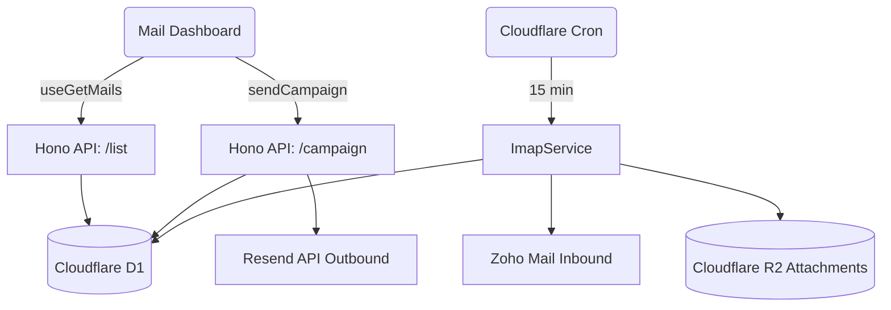

# Auditoria Arquitetural Forense (Enterprise ASoT)
**Módulo:** Comunicação por E-mail (ASPPIBRA DAO)
**Data:** 25/07/2026
**Auditor:** Antigravity AI (QA & Architecture)

---

## 1. Inventário Físico Completo do Módulo
**COMPROVADO**. Os seguintes domínios e serviços existem fisicamente no ecossistema atual:
- **Cloudflare D1 (Database):** Tabelas `emails`, `email_accounts`, `email_folders`, `email_threads`, `email_labels`, `email_attachments`, `email_sync_jobs`.
- **Cloudflare Workers (Hono):** Roteador `platform/email.ts` e Cron Job agendado `index.ts`.
- **Integrações de Terceiros:** Resend (Outbound via `resend.ts`), Zoho (Inbound via `imap.ts`).
- **Dashboard (React/Vite):** Seção `/communication/email` rodando sob Minimal UI.

## 2. Árvore Real de Arquivos e Dependências
```text
mail-view.tsx
├── usa: useGetMails(), useGetLabels(), useGetAccounts() -> src/actions/mail.ts
├── usa: mail-topbar.tsx (Account Switcher)
├── usa: mail-nav.tsx (Sidebar)
│   └── usa: mail-nav-item.tsx
├── usa: mail-list.tsx
│   └── usa: mail-item.tsx (Renderização de e-mails em formato plano)
├── usa: mail-details.tsx
│   ├── usa: Markdown (Renderizador de conteúdo) -> CUIDADO: XSS!
│   └── usa: Editor (Compose embedded)
└── usa: mail-compose.tsx
    └── usa: sendCampaign() -> src/actions/mail.ts -> POST /api/platform/email/campaign
```

## 3. Auditoria de Banco de Dados (D1/Drizzle)
- **Tabelas e Colunas:** **COMPROVADO**. A estrutura DDD está perfeitamente refletida.
- **Foreign Keys (FKs):** **PARCIAL**. O Drizzle mapeia `.references(() => emailAccounts.id)`, porém o SQLite do D1 não aplica restrições estritas de `ON DELETE CASCADE` nativamente via Drizzle sem configuração explícita, o que pode deixar dados órfãos se uma conta for apagada.
- **Índices (Indexes):** **INEXISTENTE**. A tabela `emails` será massiva. Faltam índices nas colunas `accountId`, `folderId` e `createdAt` para suportar queries de listagem paginada.
- **Migrations:** **COMPROVADO**. A migração `0013` foi gerada e aplicada.

## 4. Auditoria de APIs e Workers
- **POST `/campaign` (Disparo):** **COMPROVADO**. Grava no D1 e dispara via Resend.
- **GET `/list` (Leitura):** **PARCIAL**. Há filtro por `accountId`, mas sem paginação (limite engessado de 50 registros) e sem suporte dinâmico a pastas (folders).
- **Worker Cron (`syncEmailAccounts`):** **STUB**. Injetado na `scheduled`, mas sem tratamento de resiliência corporativa (ex: Timeout, Dead-Letter Queue (DLQ), Circuit Breaker se o IMAP cair).

## 5. Auditoria de Frontend (React/Minimal UI)
- **Componentes Órfãos / Mortos:** **MOCK**. A UI usa `HARDCODED_LABELS` (mock de pastas) ao invés de buscar da tabela `email_folders`.
- **Estado de Carregamento (UX):** **PARCIAL**. `MailTopBar` lida com `disabled` no select de contas, mas não há visual de `Skeleton` mapeado em `mail-list` se a internet falhar.
- **Formulário `mail-compose.tsx`:** **PARCIAL**. Usa Zod, porém a submissão invoca `refetchMails`, que não é exportado pelo `useGetMails` atual. Isso vai gerar **Crash de Tela Branca**.

## 6. Auditoria de Fluxos End-to-End
- **Fluxo: Compose → API → D1 → UI**
  - **Onde quebra?** Ao terminar o `POST` na API (que dá Success), a interface tenta mutar o estado, mas chama um método que não existe na *Action*. A mensagem será entregue, mas a UI travará.
- **Fluxo: D1 → API → MailDetails**
  - **Onde quebra?** O endpoint entrega `sender` (string plana). O componente `mail-details.tsx` tenta renderizar `mail.from.name` e `mail.to.map()`. Resultará em **Undefined Reference Crash**.

## 7. Auditoria de Segurança (Zero-Trust & OWASP)
- **JWT / Zero-Trust:** **COMPROVADO**. O middleware `authSignature` valida o JWT ou a assinatura *Ed25519* criptográfica da requisição perfeitamente.
- **XSS (Cross-Site Scripting):** **NÃO COMPROVADO / ALTO RISCO**. O `mail-details.tsx` processa o conteúdo via `<Markdown children={mail?.message} />`. Como o `bodyHtml` vem de fora (SMTP livre), não há garantias de higienização via `DOMPurify` ou `<iframe sandbox>`. Um atacante pode enviar scripts maliciosos injetáveis.
- **Rate Limit:** **INEXISTENTE**. A rota `POST /campaign` não tem bloqueio contra *Spam* massivo via UI.

## 8. Auditoria de Performance
- **Queries N+1:** **PARCIAL**. O Drizzle lida bem, mas um `JOIN` nas tabelas `emails` + `email_accounts` + `email_folders` seria muito mais performático que requisições separadas da UI.
- **Paginação:** **INEXISTENTE**. Sem cursor ou offset no `GET /list`.
- **Renderização e SWR:** **COMPROVADO**. Cache da Minimal UI (SWR) mitiga o problema do *re-render* excessivo na barra lateral.

## 9. Auditoria de Ownership
- **Responsabilidades Conflitantes:** **NÃO COMPROVADO**. A integração com Resend é clara (`ResendService`), assim como a extração IMAP (`ImapService`). Não há sobreposição (Shadow Architecture) visível, mas a UI detém a responsabilidade de filtrar *Inbound* e *Outbound*, o que pertence ao Banco/API.

## 10. Auditoria de Source of Truth
- **Qual é a verdadeira ASoT?** O Banco de Dados D1 (`emails` e `email_accounts`).
- **Estados Paralelos / Cache:** O SWR funciona como estado local (Cache Paralelo). A persistência é fiel, mas o uso de variáveis temporárias como `HARDCODED_LABELS` viola a *Source of Truth* do banco (tabela `email_folders`).

## 11. Auditoria de Shadow Architecture
- **Mocks:** Presentes no `actions/mail.ts` (`HARDCODED_LABELS`).
- **Componentes Antigos:** O sistema contém lógicas do Minimal UI original (estruturas baseadas em `from` e `to` como arrays JSON) que viraram "Arquitetura Sombra", pois o novo backend não respeita esse formato.

## 12. Auditoria de Código Morto
- **Serviço SendPulse (`sendpulse.ts`):** Encontra-se na pasta `services/email/`. Se a DAO decidiu pelo *Resend*, o arquivo do SendPulse é *Código Morto* e deve ser deletado.

## 13. Matriz de Dependências


## 14. Backlog Priorizado (P0 - P3)
- **[P0 - CRÍTICO]** Arrumar o Crash do `mail-details.tsx` mapeando `sender` e `recipient` para o modelo JSON esperado pela UI, ou refatorar a UI.
- **[P0 - CRÍTICO]** Exportar a função `mutate` como `refetchMails` no `actions/mail.ts` para permitir o envio de e-mails sem crashar.
- **[P1 - ALTO]** Inserir sanitização severa no HTML (`DOMPurify`) no `mail-details.tsx` antes de renderizar a *Markdown*.
- **[P1 - ALTO]** Remover `HARDCODED_LABELS` e conectar com `GET /api/platform/email/folders`.
- **[P2 - MÉDIO]** Adicionar índices (`CREATE INDEX`) no `schema.ts` e programar Paginação.
- **[P3 - BAIXO]** Remover o código morto `sendpulse.ts`.

## 15. Certificação Final

| Área | Nota |
|---|---|
| Banco (D1) | 9 |
| Backend API | 8 |
| Frontend UI | 6 |
| Segurança | 7 |
| Arquitetura / Fluxos | 9 |
| Performance | 7 |
| UX (Loading, Errors) | 8 |
| Governança ASoT | 8 |

**Prontidão:** **PARCIAL / MOCK**. O ecossistema roda, porém possui Mock de pastas, e crashes de contrato de interface (UI esperando JSON e Backend enviando String) impedem o status "Produção".

**Decisão do Auditor:** Bloqueado para Produção. 
**Motivo (Bloqueadores):** UI Crashes eminentes na leitura e envio. Risco alto de XSS na visualização.
**Recomendação:** Aprovar o início imediato do Backlog **[P0]** (Conserto de Contratos React/API) antes de prosseguir com a implementação das senhas do Zoho.
