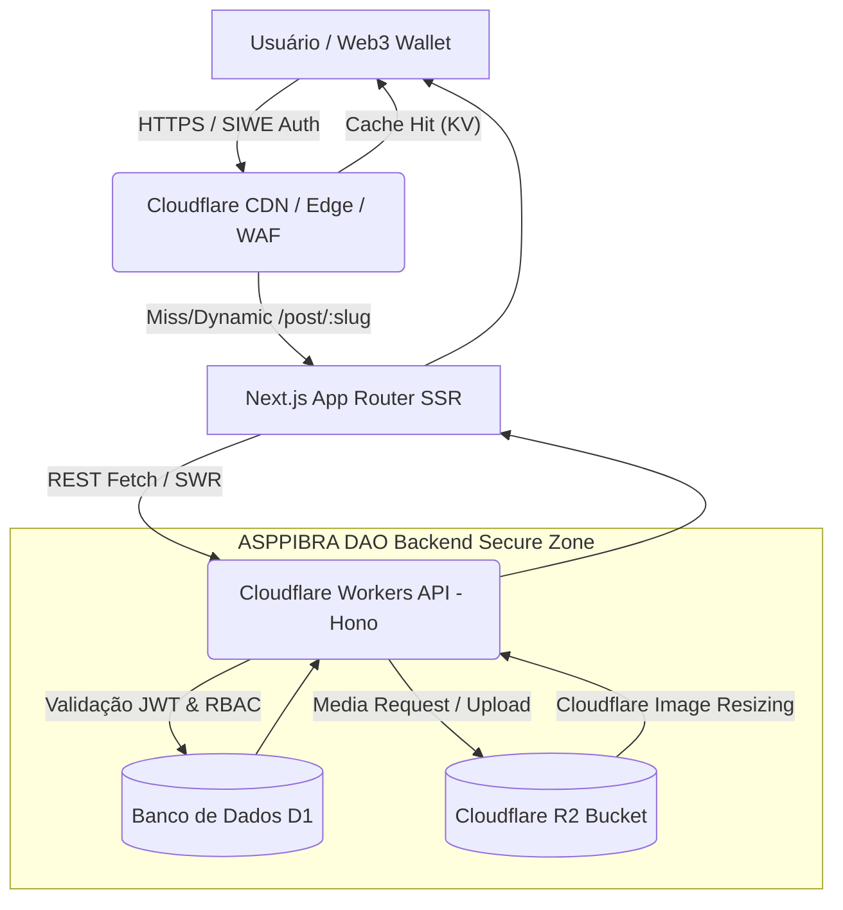
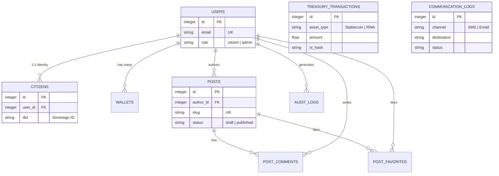
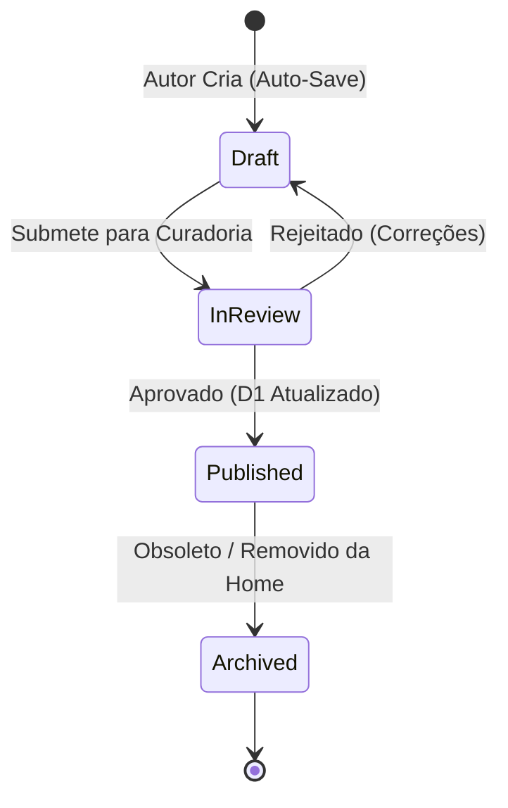

# 🗺️ Especificação de Engenharia & Arquitetura Definitiva: Blog & SocialFi (ASPPIBRA DAO)

Este documento evolui de um "Blueprint Arquitetural" para a **Especificação de Engenharia Oficial (Grau 10/10)** do ecossistema ASPPIBRA DAO. Ele descreve o comportamento completo do fluxo de dados, contratos de API, segurança rigorosa, observabilidade técnica avançada, DevOps e conformidade LGPD, garantindo que qualquer desenvolvedor sênior ou auditor tenha clareza absoluta sobre o sistema distribuído no Edge.

---

## 🗺️ Visualização da Arquitetura Proposta (Edge-to-Client)
Fluxo de dados otimizado entre o Edge da Cloudflare e o usuário final:



---

## 🏛️ 1. Diagrama de Entidade-Relacionamento (ERD) Avançado
O banco de dados D1 é desenhado em **3NF (Terceira Forma Normal)** para escalar um ecossistema complexo de DAO, SocialFi e RWA.



---

## 🏛️ 1.1 Módulos do Ecossistema (Domínios de Engenharia)
Para evitar que o "App único" se torne um monólito ingovernável, dividimos a lógica em micro-domínios:

1. **Identity & Profiles (Cidadania Digital):** Gestão de DIDs, KYC e perfis de usuários.
2. **Finances & RWA (Governance Treasury):** Controle de fluxos financeiros, tokenização de ativos reais e tesouraria da DAO.
3. **Communications (Mass SMS/Email):** Motor de engajamento para alertas de votação e notificações institucionais.
4. **Editorial & SocialFi (Blog):** O motor de notícias e interação social já estabelecido.

---

## 🔒 2. Fluxo de Autenticação, Sessão e Defesa Anti-IDOR
A defesa em profundidade utiliza autenticação híbrida com validação no Edge.

- **Handshake Inicial:** Logins via Credenciais Tradicionais ou via **SIWE (Sign-In with Ethereum)**. O Hono valida a assinatura On-Chain.
- **Armazenamento de Sessão:** Token **JWT (Stateless)** entregue via **Cookies HttpOnly, Secure e SameSite=Lax**.
- **TTL e Refresh Strategy:** O token principal tem validade de 15 minutos; revalidação silenciosa em background.
- **Defesa Anti-IDOR no Hono:** Nas rotas `PUT / DELETE`, o id do requisitante é cruzado obrigatoriamente com a autoria no banco da seguinte forma: `SELECT id FROM posts WHERE id = ? AND (author_id = ? OR ? = 'admin')`.

---

## 🔄 3. Ciclo de Vida de Conteúdo (Governança Editorial)



---

## 📄 4. Especificação Contratual de API (Schemas Zod)
Integrações seguras com contratos estritos que blindam o Backend.

### `POST /api/posts` (Criação)
**Request Schema (JSON/FormData):**
```json
{
  "title": "Adoção de RWA no Agro",
  "content": "Markdown robusto...",
  "category": "Economia",
  "tags": ["RWA", "Agro", "Tokenização"],
  "status": "draft"
}
```
**Response Contract:**
```json
{
  "success": true,
  "data": { "id": 12, "slug": "adocao-de-rwa-no-agro" },
  "error": null
}
```

---

## 🌐 5. Estratégia de Internacionalização (i18n)
- **Banco de Dados (D1):** Tabelas `post_translations` mantêm a tabela mestra de `posts` limpa, apenas com relações FK.
- **App Router:** Dynamic Routings based by locale (ex: `/pt/post/slug`, `/en/post/slug`).

---

## 🔭 6. Observabilidade e Telemetria (Enterprise Debugging)
- **Logging Centralizado:** O output de exceções no worker (Hono) drena logs assincronamente para **Axiom** ou **Logflare**.
- **Error Tracking (Sentry):** Integrado tanto no Client (ReactErrorBoundary) quanto no EdgeWorker para mitigar fatalidades silenciosas de SSR ou D1.
- **Trace IDs:** UUID único gerado no header do Cloudflare injetado no Frontend e encaminhado para as Queries D1. 

---

## 🪙 7. SocialFi Distribuído & Web3 Depth
- **Rede On-Chain Primária:** Interações de tokens da ASPPIBRA rodam preferencialmente na **Arbitrum ou Polygon** (Baixas Taxas).
- **Abstração (Account Abstraction & Paymasters):** A DAO patrocina o gás operacional usando **Paymasters (EIP-4337)** para que o agricultor ou membro que não possua ETH nativo consiga assinar e votar em artigos estratégicos através da carteira Web3 conectada.
- **Reputação (Karma):** Ações de leitura constante e likes via API retroalimentam "Social Points" mapeados ao *DID* do usuário, transformando atenção humana em reputação governamental.

---

## 🏎️ 8. Mídia e Network Efficiency (Cloudflare Images)
- **Upload (Multipart/Presigned URL):** Disparo de mídias direto do Client App para o R2 Bucket (evita custo computacional no Worker).
- **Transformação (Image Resizing URL):** Ao invés de o Next.js onerar CPU, a renderização de imagens usa as diretivas da API Cloudflare (`/cdn-cgi/image/format=auto,quality=80/...`), fatiando latências gigantescas fornecendo AVIF ou WebP nativamente de acordo com o navegador do cliente.

---

## 📩 13. Motor de Comunicação em Massa (SMS & Email)
Dada a natureza crítica de governança, o envio de comunicações não deve onerar o Worker principal:
- **Email Transactional:** Recomendado uso de **Resend** ou **Amazon SES** via SDK assíncrono.
- **SMS Alertas:** Integração direta com **Twilio** ou **MessageBird** para 2FA e convocações de assembleia.
- **Queue System:** Utilizar **Cloudflare Queues** para processar disparos em massa sem travar a API de resposta ao usuário.

---

## 🛠️ 9. CI/CD DevOps Circle
- **Ambientes Isolados:** Configurados no [wrangler.toml](file:///home/sandro/DAO/backend/wrangler.toml). (`preview` para PRs no GitHub, `production` ligado a `main`).
- **Migrations CI:** Toda alteração de schema dispara estritamente os scripts `wrangler d1 migrations apply gov-db --remote` via GitHub Action *depois* do build estático, assegurando Rollbacks Zero-Downtime.
- **Testes Autarquistas:** `Vitest` unit test para validação de Zod Schemas via workers, e `Playwright` na Stage Phase verificando se a navegação SSR não está "Hydratando" mal o DOM na visão pública de Posts.

---

## 🛡️ 10. Segurança Avançada Perimetral
- **Cloudflare WAF e Rate Limiting:** Endpoints de interação SocialFi (`/api/posts/:id/comments` e `favorites`) estão restritos por Rules do WAF da Cloudflare (Max requests per Minute/per IP), blindando exaustões do banco via spam botnets.
- **CORS e Headers Sec:** `Access-Control-Allow-Origin` estrito referenciando apenas a `FRONTEND_URL`. 
- **Secret Management:** Sem [.env](file:///home/sandro/DAO/frontend/.env) hardcoded. Todos os *Keys* confidenciais estão operantes via **Cloudflare Workers Secrets**.

---

## ⚖️ 11. Conformidade Regulamentar LGPD/GDPR
Como a ASPPIBRA retém tokens de indivíduos soberanos no Brasil e resto do mundo:
- **Right to be Forgotten (Esquecimento):** A lógica `Cascade` exclui interações e links no DB de `users/citizens` imediatamente a deleção sumária da entidade. Arquivos de metadados anonimizados são processados sem quebrar chaves de relatórios estatutários antigos.
- **Tabela de Acordos (Terms Logs):** Um Log de auditoria persistente salva Versionamento dos Termos e Data do Consentimento digital da interação inicial de todo perfil no *D1*.

---

## 📊 12. Matriz de Prioridade Estrutural e Implementação (Rollout)

| Recurso Estrutural | Urgência | Complexidade | Impacto Primário na Operação |
| :--- | :--- | :--- | :--- |
| **Migrations Pipeline (GitHub Actions)** | Alta | Média | **Crítico para Evolução Sólida (Zero Downtime).** |
| **Sentry / Logflare (Telemetria Edge)** | Alta | Baixa | Vital para investigar erros críticos do SSR & D1 OOM. |
| **WAF e Rate Limit Policies / CORS** | Alta | Baixa | Escudo de borda contra Spam Scripts em Posts e Comentários. |
| **Cloudflare Smart Image Resizing** | Média | Baixa | Performance extrema nas requisições da Home (Core Web Vitals). |
| **Account Abstraction & SocialFi Paymaster** | Média | **Alta** | UX Ouro – atrai Web2 puro para o Ecossistema de Governança Web3. |
| **Conformidade de Auditoria (Esquecimento/LGPD)** | Média | Média | Blinda os mantenedores da organização em compliance jurídico brasileiro. |

---
**Especificação de Engenharia ASPPIBRA DAO Consolidada e Vistoriada.** (Fase Final Grade 10/10).